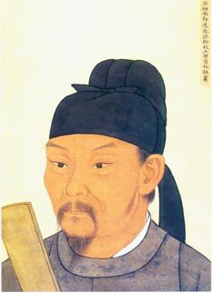

# Du Fu

### Du Fu's figure

### Introduction

Du Fu (Chinese: 杜甫; Wade–Giles: Tu Fu; 712–770) was a Chinese poet and politician of the Tang dynasty. Along with his elder contemporary and friend Li Bai (Li Po), he is frequently called the greatest of the Chinese poets.[1] His greatest ambition was to serve his country as a successful civil servant, but he proved unable to make the necessary accommodations. His life, like the whole country, was devastated by the An Lushan Rebellion of 755, and his last 15 years were a time of almost constant unrest. 

More backgroud information can be found in: [https://en.wikipedia.org/wiki/Du_Fu]()

### Writing style

Du's poems have developed into a unique new style by absorbing the artistic skills of his predecessors. Du's poetry has strong and distinctive imagery and a variety of styles. As a poet, Du Fu tended to be realistic, with a wide range of content, rich in period, drawing on political ups and downs, social unrest, warfare, and famine. Du Fu's poems are good at depicting the historical reality of the time and reflecting the current situation of the Tang Dynasty from its prosperity to its decline, so they are called "poetic history".

### Poems and Appreciations (Poems' names may vary due to different version of translation)

#### Spring View

The nation is runied,   but mountains and rivers remain.

This spring the city    is deep in weeds and brush.

Fearing leaving    the birds tangled hearths.

Watch-tower fires    have been burning for three months

To get a note from home    would cost ten thousand gold.

Scratching my    white hair thinner

Seething hopes    all in a trrembling hairpin.

-Translated by Gary Snyder

Simplified Chinese version:

《春望》

国破山河在，城春草木深。

感时花溅泪，恨别鸟惊心。

烽火连三月，家书抵万金。

白头搔更短，浑欲不胜簪。

A poetry recitation can be found in here: [https://www.youtube.com/watch?v=iCwKqC8vJNU]()

The poem was composed by Du Fu because the mixed feeling that he had when he witenessed the depression and desolation of Chang'an City as a prisoner of the war. The first four lines of this poem describe the miserable and decaying scene of Chang'an in spring, reflecting Du was full of emotions about its rise and fall. At the beginning of the poem, Du describes what he sees in the spring: how prosperous Chang'an used to be in spring, but that scene is gone today. The flowers in spring were originally delicate and bright, and their fragrance was charming; the birds in spring should be cheering and singing pleasantly, giving people pleasure. However, things have changed: the flowers and birds have resentment because of people. The last four lines of the poem are about the poet's feelings of missing his relatives and thinking about his country's affairs, which are full of miserable and sad thoughts. The war has been going on continuously for a spring, but it is still not over. "To get a note from home would cost ten thousand gold" reflects the poet's desperate feeling when he is isolated from his wife and children and has not heard from them for a long time. The last line reflects the poet's inner pain and sorrow. "White hair" is the result of sorrow, and "scratching" is a way to relieve sorrow but it never worked out. The poem is meticulously composed, with a delicate counterpoint and a melancholy voice.

