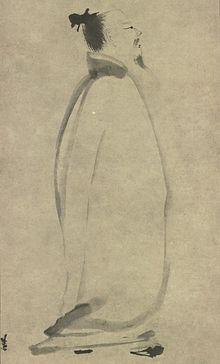

# Li Bai

### Libai's figure

### Introduction

Li Bai (Chinese: 李白; pinyin: Lǐ Bái; Pe̍h-ōe-jī: Lí Pe̍k, 701–762), also known as Li Bo, courtesy name Taibai (Chinese: 太白), art name Qinglian Jushi (Chinese: 青蓮居士), was a Chinese poet acclaimed from his own day to the present as a genius and a romantic figure who took traditional poetic forms to new heights. He and his friend Du Fu (712–770) were the two most prominent figures in the flourishing of Chinese poetry in the Tang dynasty, which is often called the "Golden Age of Chinese Poetry". 

More backgroud information can be found in: [https://en.wikipedia.org/wiki/Li_Bai]()

### Writing style

Li Bai is probably the most famous Tang Dynasty poets that people always hear about. Li Bai's poetry is a representative of Tang poetry, with its wide range of subjects, rich imagination and boldness. His poetry covers a wide range of subjects, and he has masterpieces on many of them, and his poetic style varies from period to period because of different encounters.

### Poems and Appreciations (Poems' names may vary due to different version of translation)

#### Still Night Thoughts

Moonlight in front of my bed-

I took it for frost on the ground!

I lift my head, gaze at the bright moon,

lower it and dream of home.

- Translated by Burton Watson

Simplified Chinese version:

《静夜思》

床前明月光

疑是地上霜

举头望明月

低头思故乡

A poetry recitation can be found in here: [https://www.youtube.com/watch?v=JvBReKdFYN0]()

This poem is about the feeling of missing one's hometown in the silent moonlight night.

The first two stanzas of the poem are about the illusion that the poet has for a moment in the specific environment of being a guest in another country. A person who is alone in another country can dilute his sorrow during the daytime, but when it is late at night, his heart will inevitably be filled with waves of longing for his hometown. The moon is bright, not to mention the autumn night, when the moon is as frosty. These two lines vividly express that the poet woke up from a sleep and mistook the cold moonlight in front of his bed for the frost on the ground in his daze. The word "frost" expresses even more, describing not only the brightness of the moonlight, but also the coldness of the season, and underlining the poet's loneliness and desolation in his homeland. In the last two lines of the poem, the poet deepens his homesickness through the portrayal of his movements and demeanor, showing that the poet has turned from being confused to being awake.

