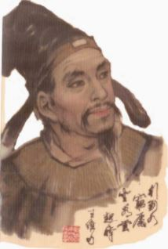

# Wang Wei

### Wang Wei's figure

### Introduction

Wang Wei (Chinese: 王維; 699–759) was a Chinese poet, musician, painter, and politician during the Tang dynasty. He was one of the most famous men of arts and letters of his time. Many of his poems are preserved, and twenty-nine were included in the highly influential 18th-century anthology Three Hundred Tang Poems.

More backgroud information can be found in: [https://en.wikipedia.org/wiki/Wang_Wei_(Tang_dynasty)]()

### Writing style

Wang Wei's achievements in poetry are manifold. In terms of poetic content, his poems on the frontier, landscape and boudoir have all been handed down to the public as masterpieces. His poems on landscapes and gardens are far-reaching and tranquil; his poems on the frontier are bright and clear, with a boldness; his poems on boudoir and friends are deep and sincere, with a touching euphemism. In his poems, Wang Wei is able to express his emotions in a quiet way, depicting the natural beauty while revealing the leisurely and relaxed interest of his leisure life.

### Poems and Appreciations (Poems' names may vary due to different version of translation)

#### Deer Enclosure

On the empty mountain, seeing no one,

Only hearing the echoes of someone's voice;

Returning light enters the deep forest,

Again shining upon the green moss.

- Translated by Richard W. Bodman and Victor H. Mair

Simplified Chinese version:

《鹿柴》

空山不见人，但闻人语响。

返景入深林，复照青苔上。

A poetry recitation can be found in here: [https://www.youtube.com/watch?v=89eH7AV69sk]()

The first impression of this poem is that it is about an empty mountain with few people and a forest of ancient trees, but it is intended to create a realm of emptiness and seclusion. The first stanza firstly describes the empty mountain without any trace, focusing on the empty and cold nature of the mountain. The second stanza is very intriguing and fascinating. The poem clearly states that there is no one in the mountain, but the poet writes that he suddenly hears the sound of someone talking, and when he looks around, he does not see a single shadow of a person, which shows how dense and deep the mountain forest is, and makes the reader feel like he is in the place. The third and fourth lines are from the description of the empty mountains in the previous frame to the description of the deep forest back to the light, from the sound to the scenery. The deep forest is dark, and the moss under the trees further highlights the lack of sunlight in the deep forest, which gives the readers the feeling of emptiness and seclusion.
